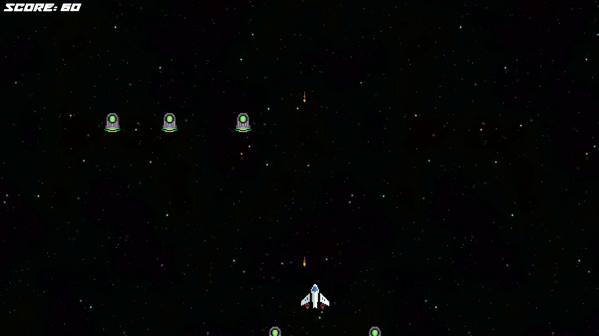

# 🎮 Game Development

Welcome to my collection of game projects! Each folder contains a unique game built with Unity, complete with source code, assets, and documentation. Feel free to explore, modify, and build upon these projects.

---

## 🌟 Game #1: Space Shooter (Unity)

### 📌 Description

A fast-paced arcade-style space shooter where players dodge and destroy waves of enemies while aiming for the highest score. Includes a game-over screen, high score tracking, and immersive sound effects.

### 🚀 Features

* 🛸 Enemy Spawning System
* 🎵 Game Over Sound & Score Display
* 🔁 Restart & Quit Functionality
* 📊 High Score Tracking
* 🕹️ Simple, Addictive Gameplay

---

## 🌟 Game #2: Pong 3D (Unity)

### 📌 Description

A 3D reimagining of the classic Pong game, featuring both Player vs. Player and Player vs. AI modes. Built upon a basic tutorial, this version includes custom enhancements, improved visuals, and robust game state management.

### 🚀 Features

* 🧊 **3D Environment** – A modern twist on the arcade classic
* 🤖 **AI Opponent** – Single-player mode with smart enemy paddle logic
* 🧑‍🤝‍🧑 **Local Multiplayer** – Face off in 2-player mode
* 📈 **Dynamic Difficulty** – Ball speed increases as the game progresses
* 🎶 **Adaptive Music System** – Music changes between menus and gameplay
* ⏸ **Pause Menu** – In-game pause with resume and main menu options
* 🏠 **Main Menu** – Mode selection and music toggle
* 🛡 **Refined Game Logic** – Smooth transitions and accurate win detection

### 🎥 Tutorial Reference

This project began as a [YouTube Pong Tutorial](https://www.youtube.com/watch?v=b3xgCUlst88), providing the foundation for core gameplay. I significantly expanded it with added features, logic fixes, and UI enhancements.

---

## 🛠 Tools Used

* 🎮 **Unity** – Game engine
* 💻 **C#** – Scripting language

---

## 👤 Author

**KareemH-1**
GitHub: [@KareemH-1](https://github.com/KareemH-1)

---

## 📜 License

This project collection is licensed under the **MIT License**. You’re free to use, modify, and share these projects with proper attribution.
