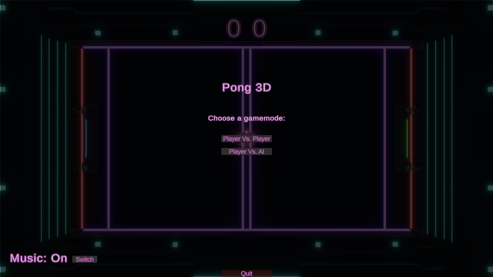
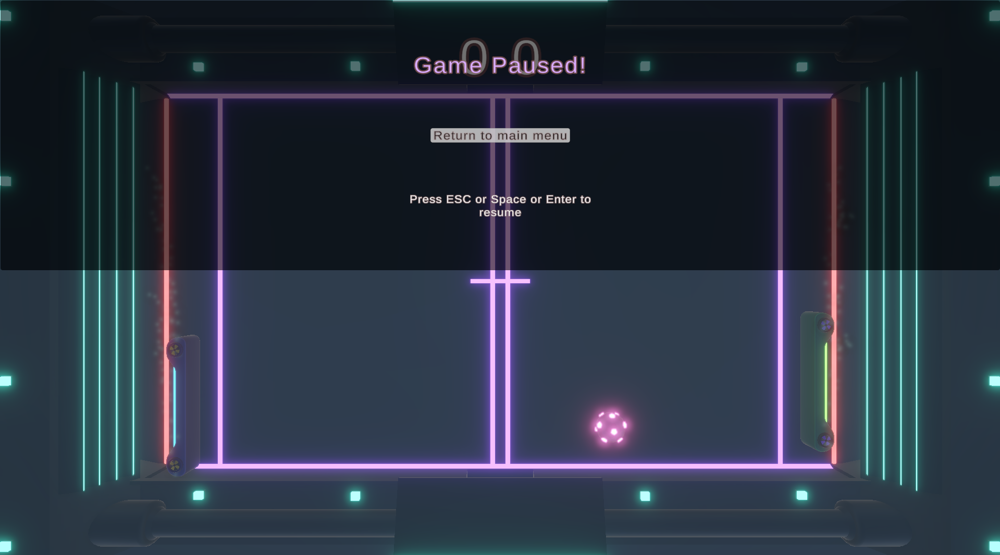
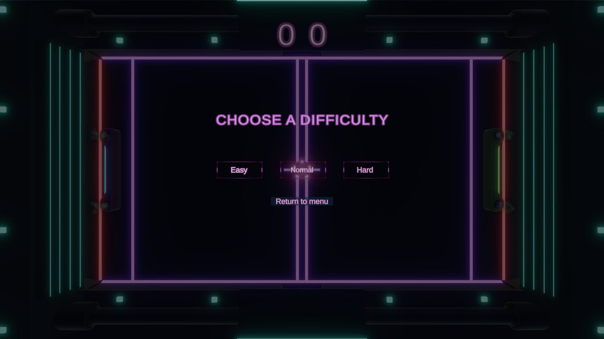
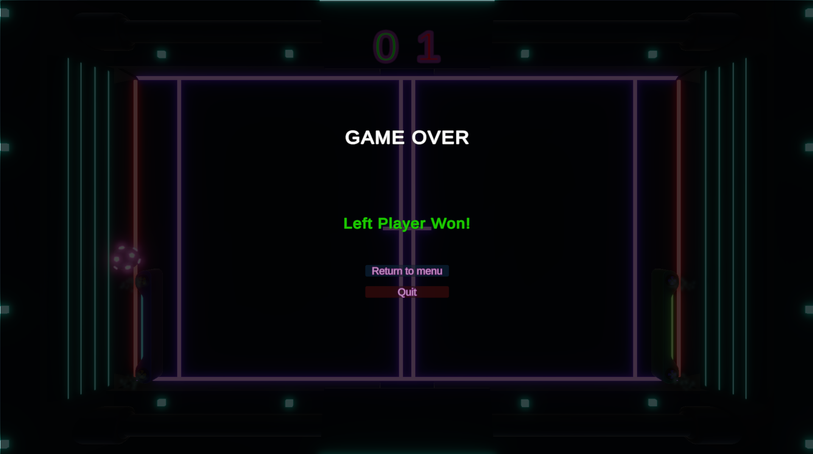

# Pong3D

A modern take on the classic Pong game, built with Unity.

## 📸 Screenshots

| Gameplay                          | Main Menu                              | Pause Menu                               |
| --------------------------------- | -------------------------------------- | ---------------------------------------- |
|  |  |  |

| AI Difficulty Panel       | Game Over Screen                      |
| ------------------------- | ------------------------------------- |
|  |  |

## 🧠 About

This project started as a Unity tutorial but has since been significantly enhanced with new features, polished mechanics, and UI/UX improvements.

### 🎓 Based on:

[How to Make a 3D Game with Unity in 1 Hour (Beginner Tutorial)](https://www.youtube.com/watch?v=b3xgCUlst88)
All base assets (e.g., sprites, scripts) were sourced from the above tutorial.

### 🛠️ My Contributions

* **AI Difficulty Levels:**

  * Added Easy, Normal, and Hard difficulty modes for the AI.
  * Difficulty affects paddle speed and reaction accuracy.
  * Difficulty selection panel appears when choosing Player vs AI mode.

* **Progressive Difficulty:**

  * Ball speed increases slightly after each hit with the racket.
  * Larger speed increase after scoring a goal.

* **Audio Enhancements:**

  * Background music added to menus and gameplay.
  * Toggle music on/off via buttons in the main and pause menus.

* **Menu System:**

  * Fully functional main menu with game mode selection.
  * New AI difficulty selection panel.
  * Pause menu for resuming or exiting the game.

* **Visual & Audio Polish:**

  * Updated lighting, fog, sound effects, and overall visuals.

* **Player vs AI Mode:**

  * Fully implemented AI logic for paddle movement and reactions.

* **Scoring & Victory Logic:**

  * Fixed scoring bugs for both PvP and PvAI.
  * Accurate winner detection regardless of paddle position or UI layout.

* **End Screen Visuals:**

  * Dynamic score coloring (winner: green, loser: red) on the game over screen.

* **Navigation Improvements:**

  * Fixed issue where returning to the main menu caused the application to close.

* **Ball Control Enhancements:**

  * Fine-tuned ball behavior during goals, pauses, and game state transitions.

## ▶️ How to Play

1. Download and extract the `.zip` file.
2. Launch the executable to start the game.
3. Select a game mode (PvP or PvAI).
4. If playing against AI, choose a difficulty before the match starts.

## 🎮 Controls

* **Player vs Player:**

  * Left Player: `W` / `S`
  * Right Player: `↑` / `↓`

* **Player vs AI:**

  * Player: `↑` / `↓`

* **Toggle Music:**

  * Click the **"Music: On/Off"** button in the **Main Menu** or **Pause Menu**.

