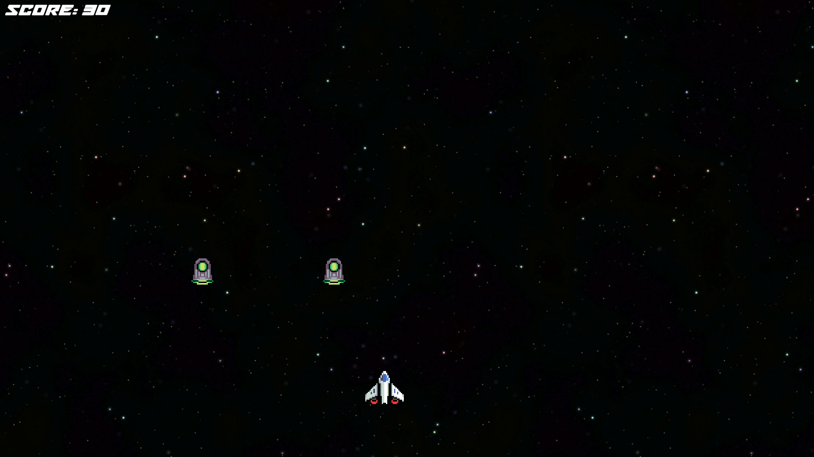
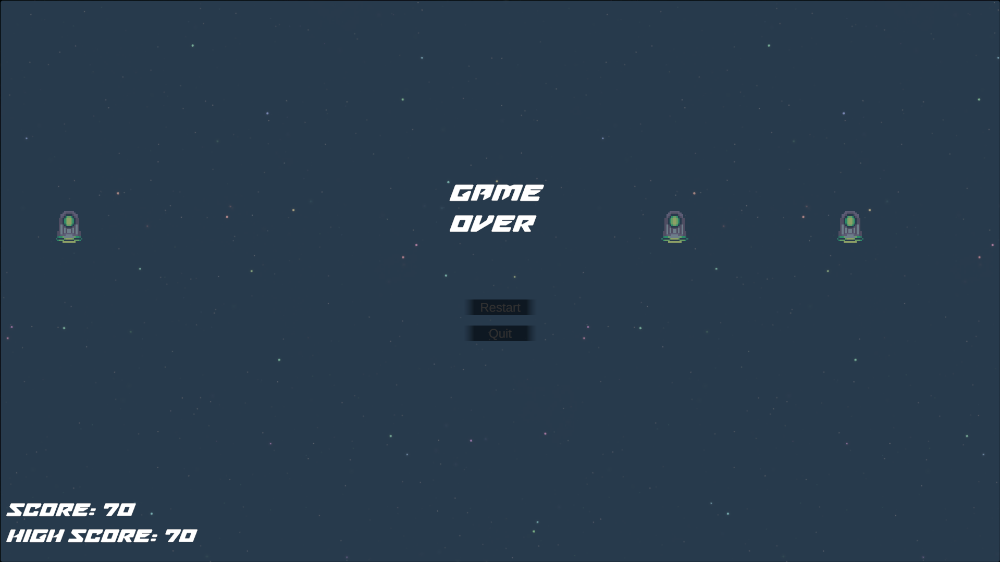
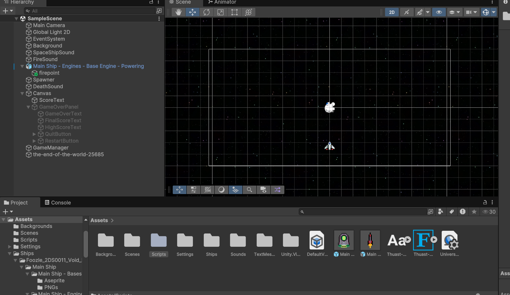

# 🎮 Space shooter game


## 📌 Description
A fun and engaging game where players must survive and score as high as possible! This game features enemies, a score tracking system, and a game-over screen.

## 🚀 Features
- 🎯 Enemy Spawning System
- 🎵 Game Over Sound & Score Display
- 🔄 Restart & Quit Options
- 📊 High Score Tracking
- 🕹️ Simple and Addictive Gameplay

## 📂 Installation
1. **Clone the Repository**:
   ```sh
   git clone https://github.com/KareemH-1/GameDevelopment.git
   ```
2. **Open in Unity**:
   - Open Unity Hub.
   - Click "Open Project" and select the cloned folder.
3. **Run the Game**:
   - Press the Play button in Unity.

## 🎮 Controls
- **Arrow Keys / WASD** - Move the player
- **Space / Return / left click** - shoot

## 📖 How to Play
1. Avoid or defeat enemies to keep playing.
2. Survive as long as possible to get a high score.
3. If you lose, the game-over screen will appear with your final score.
4. Click **Restart** to try again or **Quit** to exit the game.

## 🖼️ Screenshots
### **Gameplay**


### **Game Over Screen**


### **You should have similar Heirarchy to this**


## 📦 Build & Deployment
- **PC:** Runs as a `.exe` file in Windows.
- **Web:** Available as a WebGL build (can be uploaded to itch.io or GitHub Pages).

## 🛠️ Made With
- **Unity** - Game Engine
- **C#** - Scripting

## 👤 Author
- **KareemH-1** (GitHub: [@KareemH-1](https://github.com/KareemH-1))

## 📜 License
This project is open-source and available under the MIT License.


